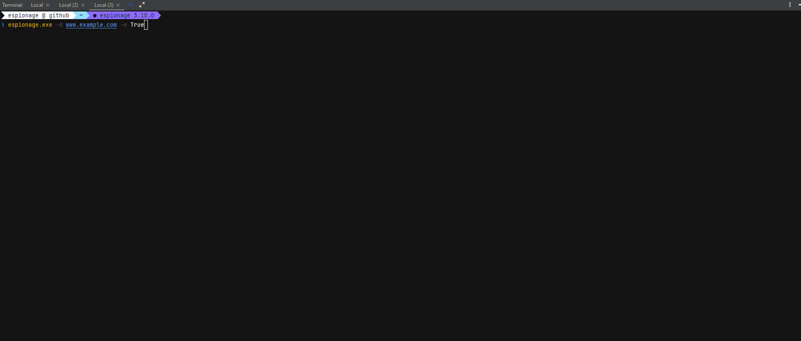

<p align="center">

</p>

---
<center>
<h3>𝙴𝚜𝚙𝚒𝚘𝚗𝚊𝚐𝚎 - 𝙳𝚘𝚖𝚊𝚒𝚗 𝚁𝚎𝚌𝚘𝚗𝚗𝚊𝚒𝚜𝚜𝚊𝚗𝚌𝚎 𝚃𝚘𝚘𝚕</h3>
</center>

---

# <p>   Work in progress ... </p>

## ⚙️Install espionage on system

### Cloning Repo

- Download & install `python 3.6` or above
- Download or clone the repo. 
- Create a virtual environment execute followings

```shell
$ git clone https://github.com/iAbdullahMughal/espionage.git
$ cd espionage
$ pip install -r requirements.txt
$ python setup.py build
$ python setup.py install
```
<p align="center">

</p>
### Using Pip
- You can install `espionage` by using pip command.
```shell
$ pip install espionage
```


# 🔗 Modules Currently Supported

- [x] 👁️‍🗨️ Domain Availability
    - By using [Mad Checker](https://madchecker.com/)
- [x] 📖 Whois
    - By using [Domain Big Data](https://domainbigdata.com/)
- [ ] 📜 Domain History Based on DNS
    - By using [Hoster Stats](http://www.hosterstats.com)
- [ ] 🎁 Dns Services ️
    - By using [Dns-Lg](http://www.dns-lg.com)

### 👁️‍🗨️ Domain Availability Check

- This module check if a domain is available or taken already.

*A domain name locates an organization or other entity on the Internet.* 

### 📖 Whois Check

Current module support following in code

#### *Domain Basic Information*

```json
 {
  "basic_info": {
    "Domain": "hacker.com",
    "Words in": "hacker",
    "Date creation": "2004-03-31",
    "Web age": "17 years and 8 months"
  }
}
```
#### *Domain Registrant Info*
```json
 {
  "registrant_info": {
    "Name": "Pinnatech Inc. D.b.a. Nauticom",
    "Organization": "Pinnatech Inc. D.b.a. Nauticom",
    "Email": "domreg@nauticom.net",
    "Address": "4008 Gibsonia Road",
    "City": "Gibsonia",
    "State": "PA",
    "Country": "United States",
    "Phone": "+1.7249339800",
    "Fax": "+1.7249339888",
    "Private": "no"
  }
}
```

#### *Name server records*
```json
 {
   "name_server": {
    "MX": [
      [
        "MX",
        "hacker.com",
        "filter.hacker.com",
        "10",
        "3600",
        "IN"
      ]
    ]
  }
}
```

#### *History Records*
```json
{
  "History": [
      [
        "Date",
        "Status",
        "Name Server"
      ],
      [
        "2014-10-09",
        "Transferred to",
        "consolidated.net"
      ]
    ]
}


```
<p align="center">

</p>


``Educational project``
